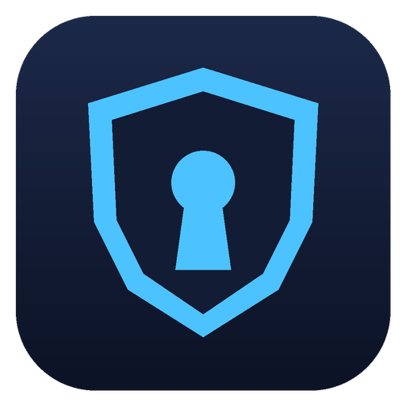
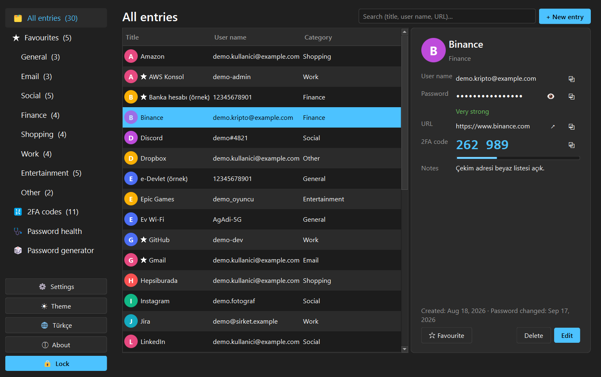
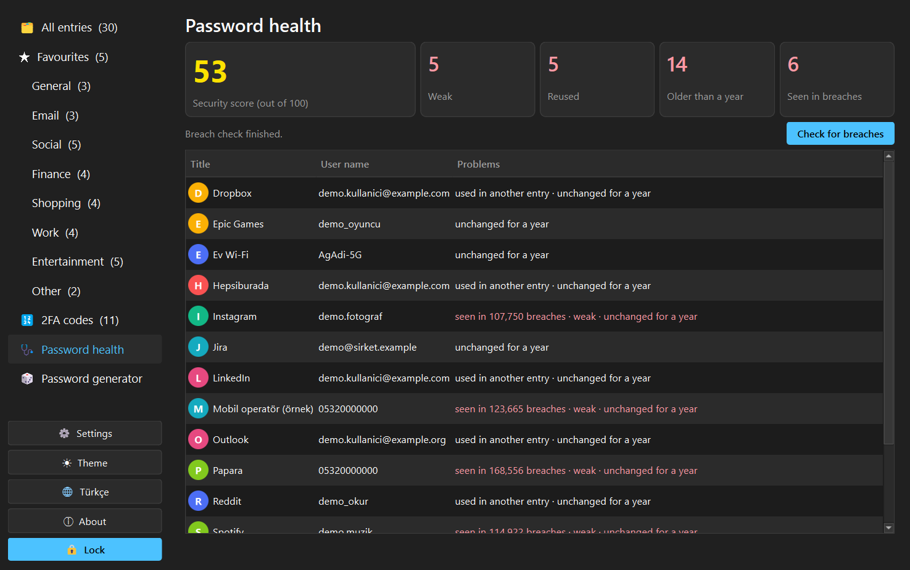
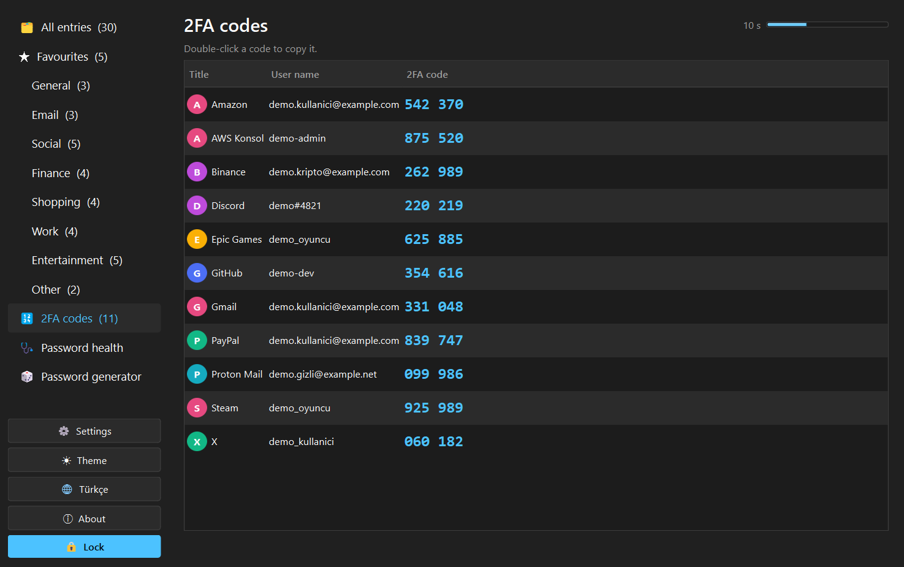
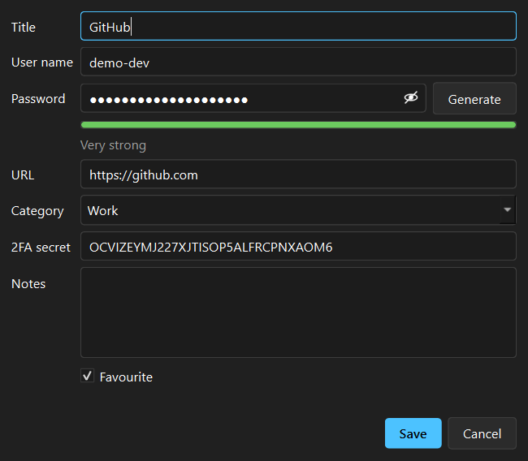
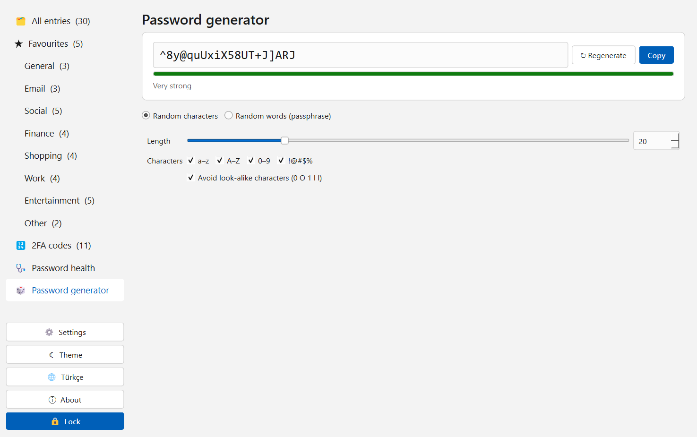
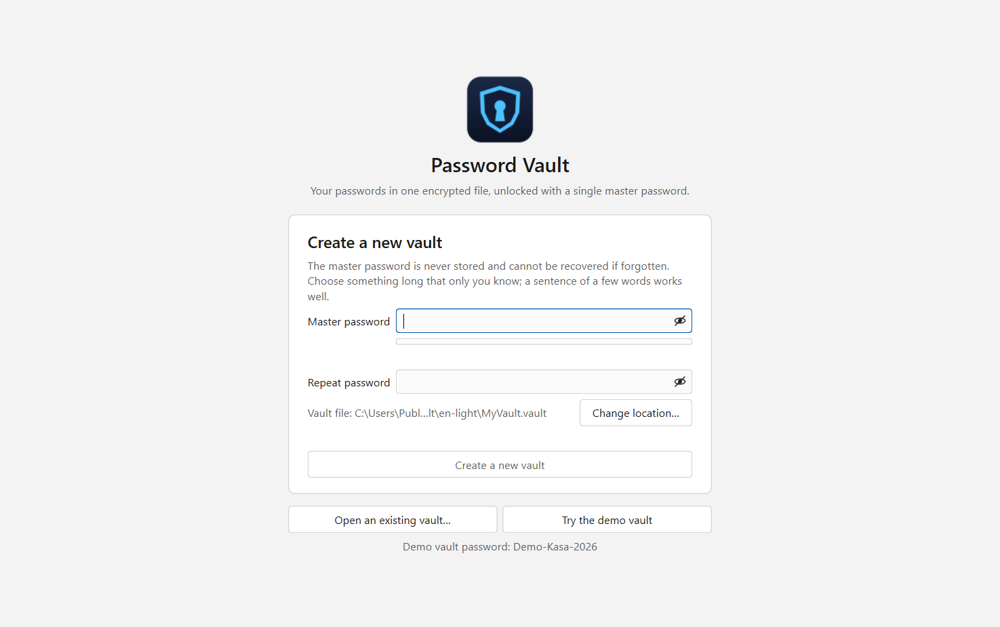
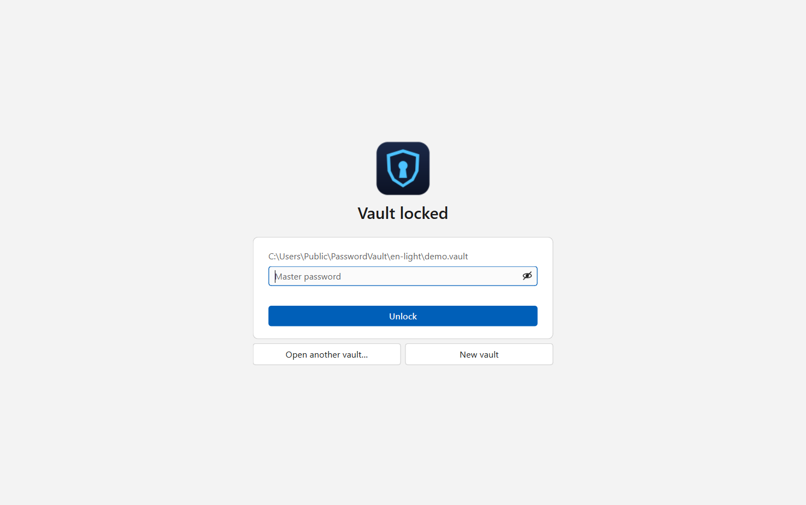

<p align="center">
  
</p>

<h1 align="center">Password Vault</h1>

<p align="center">
  <b>English</b> | <a href="README.tr.md">Türkçe</a>
</p>

<p align="center">
  A desktop password manager written in C++ and Qt.<br>
  All entries live in one encrypted vault file, unlocked with a single master password.
</p>

<p align="center">
  <a href="https://github.com/MrcDprm/security-app/releases/latest"><b>⬇️ Download for Windows</b></a>
</p>

<p align="center">
  
</p>

> **Note:** This is a portfolio project. It has not been audited by a third party; for your real passwords use an
> established, audited manager. The demo vault contains only fictional entries. The app is available in English and Turkish.

## Features

**Vault and encryption**
- The key is derived from the master password with **Argon2id** (libsodium, about 256 MB of memory); the master password is never stored
- The whole vault (titles, user names, passwords, URLs, notes) is encrypted with **XChaCha20-Poly1305**; any change to the file, including its header, is detected and the vault does not open
- Atomic saves: a crash or power cut cannot leave a half-written vault
- The key lives in locked, guarded memory (`sodium_malloc`) and is wiped when the vault locks
- Strong master password required (12+ characters, "strong" level); change it at any time

**Entries**
- Title, user name, password, URL, category, notes, favourite, 2FA secret
- Search, categories with counts, favourites; letter avatars instead of downloading site icons
- Copy user name, password, URL or 2FA code; open the URL in the browser (http/https only)

**Security features**
- **Clipboard:** copied secrets are cleared after 30 seconds and kept out of Windows clipboard history and cloud clipboard
- **Locking:** lock button, auto-lock after inactivity, lock when minimised; open windows close when the vault locks
- **Wrong passwords:** growing wait after the 3rd wrong attempt (5 s, 10 s, 20 s … up to 60 s)

**Extras**
- **Password health:** score out of 100 with weak, reused, old (1 year+) and breached passwords
- **Breach check (Have I Been Pwned):** optional, asks first; only the first 5 characters of each password's SHA-1 hash are sent (k-anonymity) and matching happens locally
- **2FA codes (TOTP, RFC 6238):** all codes on one page with a countdown; accepts Base32 secrets and `otpauth://` URLs
- **Password generator:** random characters (length, sets, no look-alikes) or passphrases from the EFF word list
- **Import:** Chrome, Edge, Firefox and Bitwarden CSV exports (offers to delete the plain-text CSV afterwards)
- **Encrypted backup** that opens with the same master password
- **Demo vault** with 30 fictional entries (password shown on the welcome screen)

## Screenshots

| Password health with breach check | 2FA codes |
|:---:|:---:|
|  |  |

| Entry form | Password generator |
|:---:|:---:|
|  |  |

| Create a vault | Locked vault |
|:---:|:---:|
|  |  |

## Installation

1. Download `PasswordVault-1.0.0-Setup.exe` from the [Releases](https://github.com/MrcDprm/security-app/releases/latest) page and run it. No administrator rights are needed.
   > The app is not digitally signed, so Windows SmartScreen may show a warning. Continue with **More info → Run anyway**.
2. Create a vault with a strong master password, or try the demo vault first.

The vault and settings are stored in `%APPDATA%\MrcDprm\PasswordVault`. Keep a copy of your vault file (or use **Settings → Export encrypted backup**); if the master password is forgotten, the vault cannot be recovered.

## Tech Stack

- **C++**, **CMake**, **Ninja**, MinGW-w64 (MSYS2 UCRT64)
- **Qt**: Widgets (UI), Network (breach check), Test (unit tests)
- **libsodium**: Argon2id, XChaCha20-Poly1305, secure memory
- **windeployqt**, **Inno Setup**: Windows installer

## Project Structure

```
src/
├── core/        Crypto, vault file format, vault session, generator, strength, TOTP, health, CSV import, demo vault
├── services/    Breach check (HIBP), secure clipboard, auto-lock
├── app/         Texts (EN/TR), settings, theme
├── ui/          Welcome, unlock, entries, entry form, 2FA, health, generator, settings, about
└── main.cpp
resources/       Icon, version info template, EFF word list
tests/           Qt Test unit tests (core, services)
installer/       Deployment script and Inno Setup script
```

### Vault file format

```
"PVLT" | version (1 byte) | Argon2 ops (4) | Argon2 memory (4) | salt (16) | nonce (24) | encrypted JSON
```

The whole header is authenticated as associated data, a new nonce is used on every save, and the Argon2 settings read from the file are bounded so a crafted file cannot exhaust memory.

## Building from Source

[MSYS2](https://www.msys2.org) must be installed. Install the packages in the **MSYS2 UCRT64** terminal:

```
pacman -S --needed mingw-w64-ucrt-x86_64-toolchain mingw-w64-ucrt-x86_64-cmake mingw-w64-ucrt-x86_64-ninja mingw-w64-ucrt-x86_64-qt6-base mingw-w64-ucrt-x86_64-libsodium mingw-w64-ucrt-x86_64-pkgconf
```

After adding `C:\msys64\ucrt64\bin` to PATH, run in the project folder:

```
cmake -S . -B build -G Ninja -DCMAKE_BUILD_TYPE=Release
cmake --build build
ctest --test-dir build --output-on-failure
```

To build the installer, also install [Inno Setup](https://jrsoftware.org/isinfo.php) and run:

```
powershell -ExecutionPolicy Bypass -File installer\deploy.ps1
ISCC installer\PasswordVault.iss
```

## What I Learned

- I learned the difference between hashing a password and deriving a key from it: Argon2id turns the master password and a random salt into a 32-byte key, and it is deliberately slow and memory-hungry so that guessing attacks become expensive.
- I used authenticated encryption (XChaCha20-Poly1305): it does not only hide the data, it also proves the data was not changed. I put the file header in the associated data, so even changing a single header byte makes the vault refuse to open.
- I designed a small binary file format with a magic number, a version byte and bounded parameters, and learned why values read from a file (like the Argon2 memory size) must be limited before they are used.
- I learned why a nonce must never repeat with the same key, and that a new random nonce on every save avoids it.
- I kept the key in libsodium's guarded memory, made the key class non-copyable, wiped temporary buffers with `sodium_memzero` and compared keys in constant time with `sodium_memcmp`.
- I implemented TOTP (RFC 6238) myself with HMAC-SHA1 and Base32 decoding, and checked it against the official test vectors.
- I used k-anonymity for the breach check: only a 5-character hash prefix leaves the computer, and the response is padded so its size does not reveal the prefix.
- I wrote a password strength estimator that combines entropy with penalties for common passwords, sequences and repeats, and used it to reject weak master passwords.
- I learned practical desktop security details: clearing the clipboard, keeping secrets out of Windows clipboard history, auto-locking after inactivity and closing open dialogs on lock.
- I parsed real-world CSV exports (quoted fields, line breaks inside fields, different column orders) and validated every imported field.
- I tested the security properties, not just the happy path: tampered headers and contents, wrong passwords, unsupported versions and crafted memory parameters all have unit tests.

## Future Plans

- Browser extension for auto-fill
- Sync between devices
- File attachments in entries
- Windows Hello unlock
- Password history per entry

## License

[MIT](LICENSE). Word list: [EFF Short Wordlist](https://www.eff.org/dice) (CC BY 3.0 US). Breach data: [Have I Been Pwned](https://haveibeenpwned.com/Passwords).
