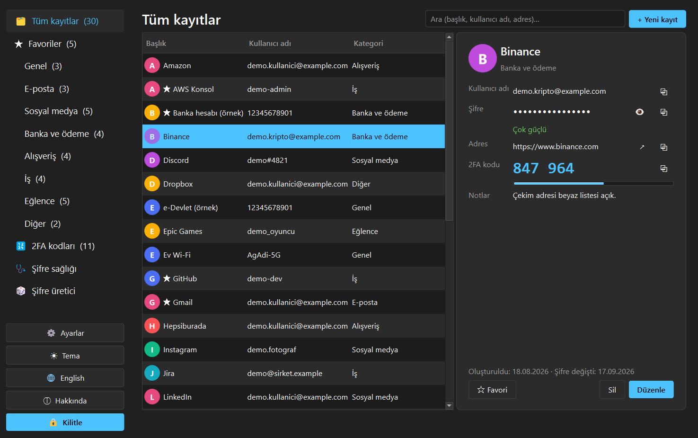
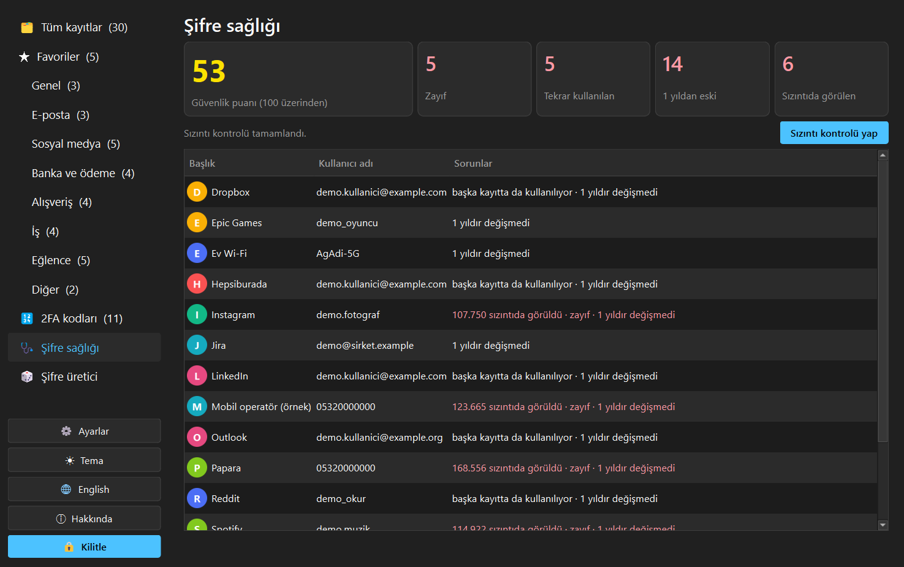
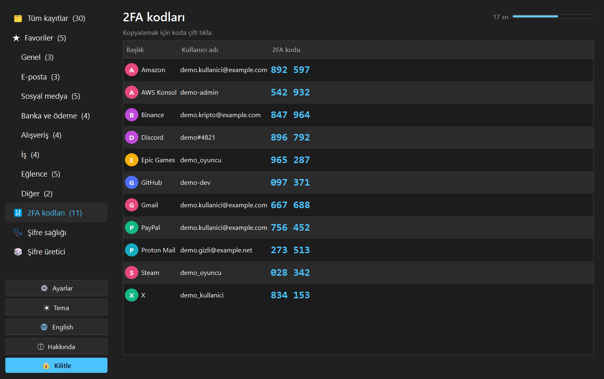
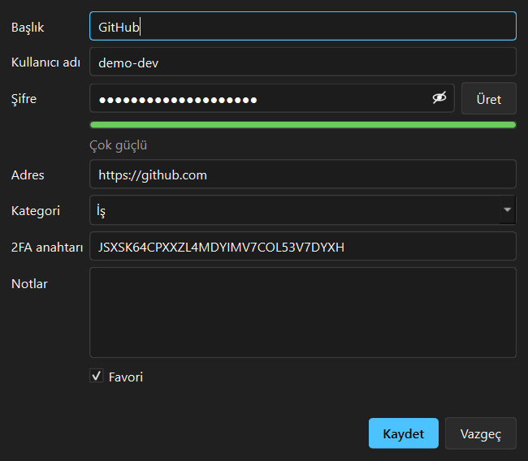
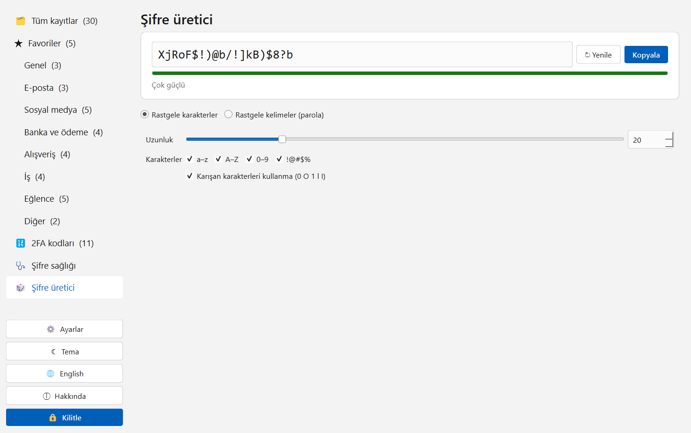
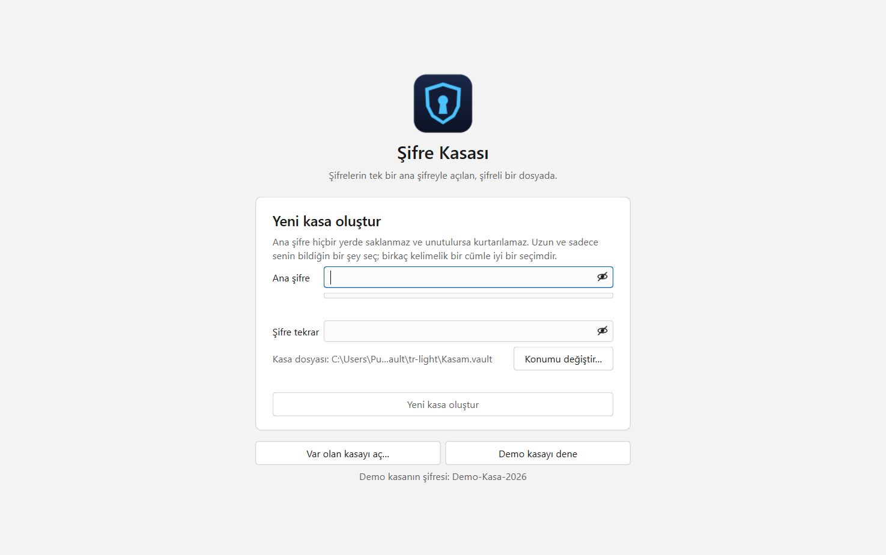
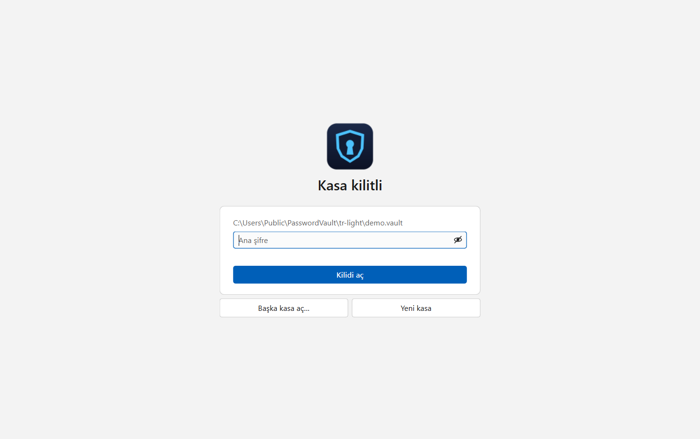

<p align="center">
  
</p>

<h1 align="center">Şifre Kasası</h1>

<p align="center">
  <a href="README.md">English</a> | <b>Türkçe</b>
</p>

<p align="center">
  C++ ve Qt ile yazılmış masaüstü şifre yöneticisi.<br>
  Bütün kayıtlar tek bir ana şifreyle açılan, tek bir şifreli kasa dosyasında durur.
</p>

<p align="center">
  <a href="https://github.com/MrcDprm/security-app/releases/latest"><b>⬇️ Windows için indir</b></a>
</p>

<p align="center">
  
</p>

> **Not:** Bu bir portfolyo projesidir ve bağımsız bir güvenlik denetiminden geçmemiştir; gerçek şifrelerin için
> denetlenmiş, yaygın bir şifre yöneticisi kullan. Demo kasada sadece hayali kayıtlar vardır. Uygulama Türkçe ve İngilizce kullanılabilir.

## Özellikler

**Kasa ve şifreleme**
- Anahtar ana şifreden **Argon2id** ile türetilir (libsodium, yaklaşık 256 MB bellek); ana şifre hiçbir yerde saklanmaz
- Kasanın tamamı (başlıklar, kullanıcı adları, şifreler, adresler, notlar) **XChaCha20-Poly1305** ile şifrelenir; dosyada, başlığı da dahil, yapılan en küçük değişiklik fark edilir ve kasa açılmaz
- Atomik kayıt: program çökse ya da elektrik kesilse de kasa yarım yazılmış kalmaz
- Anahtar kilitli ve korumalı bellekte (`sodium_malloc`) durur, kasa kilitlenince silinir
- Güçlü ana şifre zorunlu (12+ karakter, "güçlü" seviye); istenince değiştirilebilir

**Kayıtlar**
- Başlık, kullanıcı adı, şifre, adres, kategori, not, favori, 2FA anahtarı
- Arama, sayılarıyla kategoriler, favoriler; site ikonu indirmek yerine harf avatarları
- Kullanıcı adı, şifre, adres ya da 2FA kodu kopyalama; adresi tarayıcıda açma (sadece http/https)

**Güvenlik özellikleri**
- **Pano:** kopyalanan bilgi 30 saniye sonra silinir; Windows pano geçmişine ve bulut panosuna düşmez
- **Kilit:** kilit düğmesi, hareketsizlikte otomatik kilit, simge durumuna küçültünce kilit; kilitlenince açık pencereler kapanır
- **Yanlış şifre:** 3. yanlış denemeden sonra artan bekleme (5 sn, 10 sn, 20 sn … en fazla 60 sn)

**Ekler**
- **Şifre sağlığı:** 100 üzerinden puan; zayıf, tekrar kullanılan, eski (1 yıl+) ve sızıntıda görülen şifreler
- **Sızıntı kontrolü (Have I Been Pwned):** isteğe bağlı, önce onay ister; her şifrenin SHA-1 özetinin sadece ilk 5 karakteri gönderilir (k-anonimlik), eşleşme bu bilgisayarda aranır
- **2FA kodları (TOTP, RFC 6238):** bütün kodlar geri sayımla tek sayfada; Base32 anahtar ya da `otpauth://` adresi kabul eder
- **Şifre üretici:** rastgele karakterler (uzunluk, gruplar, karışan karakterler olmadan) ya da EFF kelime listesinden parola
- **İçe aktarma:** Chrome, Edge, Firefox ve Bitwarden CSV'leri (sonrasında düz metin CSV'yi silmeyi önerir)
- **Şifreli yedek:** aynı ana şifreyle açılır
- **Demo kasa:** 30 hayali kayıt (şifresi karşılama ekranında yazar)

## Ekran Görüntüleri

| Sızıntı kontrollü şifre sağlığı | 2FA kodları |
|:---:|:---:|
|  |  |

| Kayıt formu | Şifre üretici |
|:---:|:---:|
|  |  |

| Kasa oluşturma | Kilitli kasa |
|:---:|:---:|
|  |  |

## Kurulum

1. [Releases](https://github.com/MrcDprm/security-app/releases/latest) sayfasından `PasswordVault-1.0.0-Setup.exe` dosyasını indirip çalıştır. Yönetici izni gerekmez.
   > Uygulama dijital olarak imzalı olmadığı için Windows SmartScreen uyarı gösterebilir. **Ek bilgi → Yine de çalıştır** ile devam edebilirsin.
2. Güçlü bir ana şifreyle kasa oluştur ya da önce demo kasayı dene.

Kasa ve ayarlar `%APPDATA%\MrcDprm\PasswordVault` klasöründe durur. Kasa dosyanın bir kopyasını sakla (ya da **Ayarlar → Şifreli yedek al**); ana şifre unutulursa kasa kurtarılamaz.

## Kullanılan Teknolojiler

- **C++**, **CMake**, **Ninja**, MinGW-w64 (MSYS2 UCRT64)
- **Qt**: Widgets (arayüz), Network (sızıntı kontrolü), Test (birim testleri)
- **libsodium**: Argon2id, XChaCha20-Poly1305, güvenli bellek
- **windeployqt**, **Inno Setup**: Windows kurulum dosyası

## Proje Yapısı

```
src/
├── core/        Kriptografi, kasa dosya biçimi, kasa oturumu, üretici, güç ölçer, TOTP, sağlık, CSV, demo kasa
├── services/    Sızıntı kontrolü (HIBP), güvenli pano, otomatik kilit
├── app/         Metinler (TR/EN), ayarlar, tema
├── ui/          Karşılama, kilit, kayıtlar, kayıt formu, 2FA, sağlık, üretici, ayarlar, hakkında
└── main.cpp
resources/       İkon, sürüm bilgisi şablonu, EFF kelime listesi
tests/           Qt Test birim testleri (core, services)
installer/       Dağıtım betiği ve Inno Setup betiği
```

### Kasa dosya biçimi

```
"PVLT" | sürüm (1 bayt) | Argon2 işlem (4) | Argon2 bellek (4) | tuz (16) | nonce (24) | şifreli JSON
```

Başlığın tamamı ek veri olarak doğrulanır, her kayıtta yeni nonce kullanılır ve dosyadan okunan Argon2 ayarları sınırlıdır; hazırlanmış bir dosya belleği tüketemez.

## Kaynaktan Derleme

[MSYS2](https://www.msys2.org) kurulu olmalı. Paketleri **MSYS2 UCRT64** terminalinde kur:

```
pacman -S --needed mingw-w64-ucrt-x86_64-toolchain mingw-w64-ucrt-x86_64-cmake mingw-w64-ucrt-x86_64-ninja mingw-w64-ucrt-x86_64-qt6-base mingw-w64-ucrt-x86_64-libsodium mingw-w64-ucrt-x86_64-pkgconf
```

`C:\msys64\ucrt64\bin` klasörünü PATH'e ekledikten sonra proje klasöründe:

```
cmake -S . -B build -G Ninja -DCMAKE_BUILD_TYPE=Release
cmake --build build
ctest --test-dir build --output-on-failure
```

Kurulum dosyasını oluşturmak için [Inno Setup](https://jrsoftware.org/isinfo.php) da kurulu olmalı:

```
powershell -ExecutionPolicy Bypass -File installer\deploy.ps1
ISCC installer\PasswordVault.iss
```

## Öğrendiklerim

- Şifreyi özetlemekle (hash) şifreden anahtar türetmek arasındaki farkı öğrendim: Argon2id ana şifreyi ve rastgele bir tuzu 32 baytlık bir anahtara çeviriyor; bilerek yavaş ve çok bellek isteyen bir fonksiyon olduğu için tahmin saldırıları pahalı hâle geliyor.
- Kimliği doğrulanmış şifreleme (XChaCha20-Poly1305) kullandım: veriyi sadece gizlemiyor, değiştirilmediğini de kanıtlıyor. Dosya başlığını ek veriye (AAD) koydum; başlıkta tek bir bayt değişse bile kasa açılmıyor.
- Sihirli sayı, sürüm baytı ve sınırlı parametrelerle küçük bir ikili dosya biçimi tasarladım; dosyadan okunan değerlerin (Argon2 bellek miktarı gibi) kullanılmadan önce neden sınırlanması gerektiğini öğrendim.
- Aynı anahtarla aynı nonce'un neden asla tekrar kullanılmaması gerektiğini ve her kayıtta yeni rastgele nonce'un bunu nasıl önlediğini öğrendim.
- Anahtarı libsodium'un korumalı belleğinde tuttum, anahtar sınıfını kopyalanamaz yaptım, geçici tamponları `sodium_memzero` ile sildim ve anahtarları `sodium_memcmp` ile sabit sürede karşılaştırdım.
- TOTP'yi (RFC 6238) HMAC-SHA1 ve Base32 çözme ile kendim yazdım ve resmî test değerleriyle doğruladım.
- Sızıntı kontrolünde k-anonimlik kullandım: bilgisayardan sadece 5 karakterlik özet öneki çıkıyor; yanıt dolgulu geldiği için boyutundan da önek anlaşılamıyor.
- Entropiyi yaygın şifreler, diziler ve tekrarlar için cezalarla birleştiren bir güç ölçer yazdım ve zayıf ana şifreleri reddetmek için kullandım.
- Masaüstünde pratik güvenlik ayrıntılarını öğrendim: panoyu temizlemek, şifreleri Windows pano geçmişinden uzak tutmak, hareketsizlikte kilitlemek ve kilitlenince açık pencereleri kapatmak.
- Gerçek CSV dışa aktarımlarını (tırnaklı alanlar, alan içinde satır sonu, farklı sütun sıraları) okudum ve içe aktarılan her alanı doğruladım.
- Sadece mutlu yolu değil güvenlik özelliklerini de test ettim: kurcalanmış başlık ve içerik, yanlış şifre, desteklenmeyen sürüm ve hazırlanmış bellek parametrelerinin hepsinin birim testi var.

## Gelecek Planları

- Otomatik doldurma için tarayıcı eklentisi
- Cihazlar arası eşitleme
- Kayıtlara dosya ekleme
- Windows Hello ile kilit açma
- Kayıt başına şifre geçmişi

## Lisans

[MIT](LICENSE). Kelime listesi: [EFF Short Wordlist](https://www.eff.org/dice) (CC BY 3.0 US). Sızıntı verisi: [Have I Been Pwned](https://haveibeenpwned.com/Passwords).
